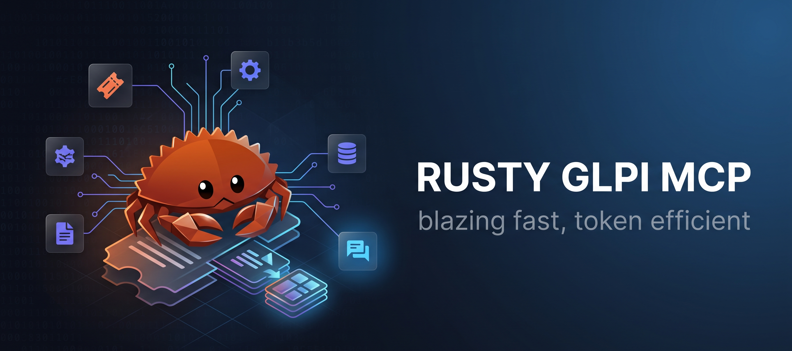

# Rusty GLPI MCP

<p align="left">
  
</p>

**A high performance, token efficient [Model Context Protocol](https://modelcontextprotocol.io) server for [GLPI](https://glpi-project.org/)**, rewritten in Rust from the ground up for Claude Code and any MCP compatible client. Every response is built around spending as few tokens as possible, so your context window lasts for a whole conversation instead of one ticket lookup.

**46 tools** covering tickets, followups, tasks, solutions, statistics, the knowledge base, users and groups, and ticket routing rules.

<p align="left">
  
  
  
  
</p>

## Why this rewrite

The original prototype was Python and `FastMCP`. It worked, but it also loaded every single ticket into memory for a basic stats query, kept a global mutable session token, and shipped as an interpreted script with a whole dependency tree behind it. This rewrite fixes all of that at the language level:

* **Every answer is built to spend as few tokens as possible.** Responses come back as compact Markdown tables and field lists, not raw GLPI JSON. All GLPI HTML noise (inline styles, entity codes, HATEOAS `links` arrays) is stripped before it ever reaches the model. Reports that would otherwise pull every field of every ticket now request only the columns each answer actually needs. Real world result on a ticket with 8000+ characters of HTML: a Markdown response under 2000 characters, same information.
* **Starts and answers instantly.** It is a single compiled program, not a script an interpreter has to read line by line every time it runs. Ask something and get an answer with no warm up delay.
* **Barely uses any memory.** A few megabytes while running, instead of a whole Python environment plus every library it drags along. Your machine (or your server) barely notices it is there.
* **Logs itself back in on its own.** GLPI sessions expire. When that happens this server quietly reauthenticates and finishes your request anyway. You never see a broken "session expired" error.
* **Cannot crash GLPI with a big request.** Reports that used to pull every single ticket in one giant request (and could overload a busy GLPI server) are now fetched a small page at a time, automatically.
* **Handles many people at once, safely.** Several teammates can use it at the same time and it will never mix up one person's data with another's or corrupt what it is doing.
* **Fails loudly instead of silently.** If GLPI is unreachable or sends back something unexpected, you get a clear, specific error message instead of a confusing empty result nobody can explain.
* **GLPI 10 and GLPI 11, same binary.** API prefix and search option field IDs are resolved per version at runtime, so one build talks to either release.

## Quick start

### 1. Get the binary

Grab the latest `glpi mcp` build for your OS from the [Releases](../../releases) page and put it somewhere on your `PATH` (or note its full path, you will need it below).

### 2. Get your GLPI API credentials

In GLPI: **Setup → General → API**, enable the REST API and grab an **App Token**. Then generate a **User Token** for the account the server will act as (**Administration → Users → your user → Remote access keys**).

### 3. Register the server in Claude Code

```bash
claude mcp add glpi \
  --env GLPI_URL=https://glpi.example.com \
  --env GLPI_APP_TOKEN=your_app_token \
  --env GLPI_USER_TOKEN=your_user_token \
  --env GLPI_VERSION=10 \
  --env GLPI_VERIFY_TLS=false \
  -- /path/to/glpi-mcp
```

* `GLPI_VERSION`: `10` or `11`, depending on your instance.
* `GLPI_VERIFY_TLS`: `false` by default (fine for intranet or self signed certificates), set `true` for a publicly trusted certificate.

Prefer a project scoped config instead? Drop this in `.mcp.json` at your project root:

```json
{
  "mcpServers": {
    "glpi": {
      "command": "/path/to/glpi-mcp",
      "env": {
        "GLPI_URL": "https://glpi.example.com",
        "GLPI_APP_TOKEN": "your_app_token",
        "GLPI_USER_TOKEN": "your_user_token",
        "GLPI_VERSION": "10",
        "GLPI_VERIFY_TLS": "false"
      }
    }
  }
}
```

### 4. Use it

Restart Claude Code (or run `claude mcp list` to confirm `glpi` is connected), then just ask: *"list my open incidents"*, *"create a ticket for the printer on the 3rd floor"*, *"what is our average resolution time this month?"*.

## Available tools

### 🔐 Session

* `kill_session` — gracefully closes the active GLPI session

### 🎫 Tickets

* `list_tickets` — list tickets with pagination and filters (status, type)
* `get_ticket` — full ticket details with readable labels
* `search_tickets` — advanced search by keywords, status, type, category, assignee
* `create_ticket` — create a new ticket
* `update_ticket` — update fields of an existing ticket
* `delete_ticket` — delete a ticket
* `link_tickets` — link two tickets (linked, duplicate, child, parent)
* `list_ticket_links` — list all links of a ticket
* `merge_tickets` — merge source tickets into a target, copies followups, links as duplicate, closes sources

### 💬 Followups

* `list_followups` — list all followups of a ticket
* `get_followup` — followup details
* `add_followup` — add a followup, public or private

### ✅ Tasks

* `list_tasks` — list tasks of a ticket
* `add_task` — create a task on a ticket
* `update_task` — update a task (status, duration, assignee)
* `delete_task` — delete a task

### 💡 Solutions

* `get_solution` — read the solution of a ticket
* `add_solution` — post a solution, closes the ticket per GLPI configuration

### 📊 Statistics

* `stats_by_status` — ticket count grouped by status
* `stats_by_type` — incidents versus service requests
* `stats_by_priority` — open tickets grouped by priority
* `stats_by_category` — ticket count grouped by ITIL category
* `stats_by_assignee` — tickets per assigned technician
* `stats_resolution_time` — average ticket resolution time
* `stats_overdue` — tickets past their resolution deadline

### 📚 Knowledge base

* `list_kb_articles` — list articles with pagination, auto clamped for very large offsets to avoid GLPI memory limits
* `get_kb_article` — full article details
* `search_kb_articles` — search by keywords, title only by default, optional full body search
* `create_kb_article` — create a new article
* `update_kb_article` — update an existing article
* `list_kb_categories` — list knowledge base categories
* `get_kb_article_visibility` — read visibility rules of an article
* `add_kb_article_visibility_profile` — add a profile to an article visibility
* `add_kb_article_visibility_group` — add a group to an article visibility
* `update_kb_article_visibility_profile` — update a profile visibility rule
* `update_kb_article_visibility_group` — update a group visibility rule

### 👥 Users and groups

* `get_users` — list GLPI users
* `get_groups` — list GLPI groups
* `find_group` — find groups by name/acronym, shows ID and full hierarchy path
* `create_group` — create a new GLPI group
* `update_group` — update an existing group
* `delete_group` — delete a group

### 📐 Ticket routing rules

* `find_group_rule_references` — scan RuleTicket rules for criteria/actions referencing a group, e.g. before deactivating it
* `update_rule_action` — update a rule action's value, e.g. redirect routing to a different group

### 📋 Reference data

* `list_itil_categories` — list available ITIL categories

## License

MIT, see [LICENSE](LICENSE).

## Found this useful?

Star the repo. It costs nothing and helps more people find this project.
